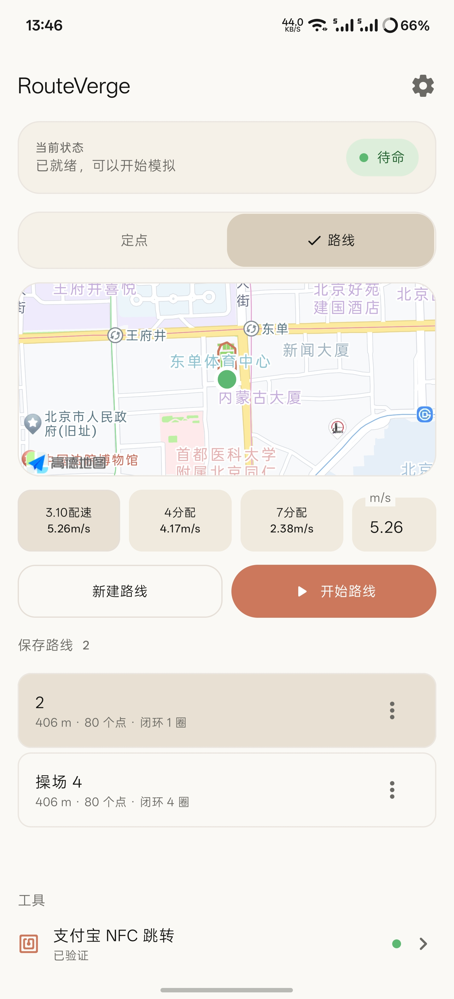
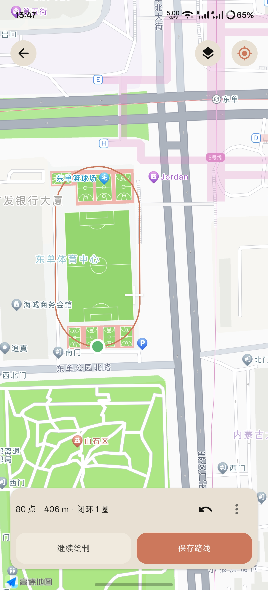

# RouteVerge

> 一款基于 Android 现代架构与 Claude 暖色设计风格的高精度本地位置与路线运动模拟测试工具。

---

## 📱 应用截图

<p align="center">
  
  
</p>

## 🌟 项目核心功能

RouteVerge 为 Android 平台的位置相关应用开发、地图 SDK 调试、跑步/轨迹算法验证及测试人员提供一体化的模拟工具：

- **定点位置模拟**：支持在地图上任意点击选点，或直接输入 WGS-84 经纬度数值，开启高精度定点位置 Mock。
- **路线运动模拟**：多点折线平滑插值模拟，支持循环绕圈、往返闭环、单向回放等多种运动模式。
- **路线编辑与地图选点**：内置自由绘制手势选点、点位回退撤销、清除重选，并支持标准 400 米操场椭圆跑道模板一键生成与旋转。
- **点位与路线管理**：本地持久化保存常用测试点位和多条测试路线，支持重命名、编辑、覆盖更新与删除。
- **实时运动控制**：路线模拟过程中可随时执行“暂停”、“继续”与“停止”，暂停后保持当前位置不跳变，继续时沿原轨迹平滑推进。
- **动态配速调节**：提供步行（6 km/h）、慢跑（10 km/h）、快跑（15 km/h）等多档常用速度预设，同时支持任意自定义速度输入。
- **支付宝 NFC 快捷联动**：支持手机 NFC 硬件状态检测、已绑卡状态验证，以及一键调起支付宝 NFC 刷卡界面，跳转期间模拟任务在后台持续平稳运行。
- **前台保活与状态通知**：使用 Android 标准 Location 前台服务与 CPU WakeLock，保证锁屏、应用退至后台或跨应用跳转时不被系统轻易回收。
- **坐标系智能转换**：内置 WGS-84（GPS 国际通用坐标）与 GCJ-02（国内高德/火星坐标）双向精确转换引擎，避免地图打点与真实系统定位产生偏移。
- **双地图引擎兼容**：集成高德地图 3D SDK 与 Google Maps SDK，可根据网络环境与测试场景灵活适配。

---

## 📱 主要页面说明

1. **首页控制台 (HomeScreen / AppRoot)**
   - **状态看板 (HomeStatusSection)**：实时展示当前模拟器运行状态（未运行 / 定点模拟中 / 路线模拟中 / 已暂停）、Mock 提供者标识、当前步进频率及持续时间。
   - **双模切换胶囊 (ModeSelector)**：以 Claude 暖色滑块动态切换“定点模拟”与“路线模拟”。
   - **地图实时预览**：在主屏内嵌高保真交互地图，路线运行时动态渲染实时轨迹线与当前模拟位置图标。
   - **模拟控制面板 (SimulationSection)**：集成配速预设选择器、开始/暂停/停止按钮。
   - **历史记录视窗 (SavedRoutesSection)**：独立记录点位列表与路线列表，支持点击即装载测试。
   - **NFC 工具栏 (NfcToolsRow)**：展示 NFC 硬件就绪状态，提供一键直达支付宝刷卡界面的便捷入口。
2. **路线编辑器 (RouteEditorScreen)**
   - 全屏地图打点选点，支持点击连续添加轨迹点。
   - **自由绘制模式**：手指在地图上滑动即可连续捕获平滑轨迹。
   - **椭圆模板生成器 (TemplateTransformSurface)**：一键放置标准 400 米跑道模型，支持拖动调整中心、长度、宽度与旋转角度。
   - 闭环与圈数设置：支持开启闭环并在 1~99 圈之间设定循环次数。
3. **定点地图选点器 (MapPointPickerScreen)**
   - 快速定位至设备当前物理位置，十字准星选点，支持微调经纬度并一键命名保存为常用点位。
4. **设置中心 (SettingsScreen)**
   - 地图引擎切换（高德地图 / Google Maps）；
   - 坐标系统显示偏好与步频抖动参数配置；
   - 开发者选项“模拟位置信息应用”设置指引。

---

## 📍 定点模拟功能

定点模拟用于固定位置相关的业务调试（如考勤打卡边界验证、电子围栏触发、特定商圈服务测试等）。
- 支持手动输入经纬度（支持 6 位以上小数高精度坐标）。
- 支持直接在地图中心十字靶心微调定点。
- 支持将当前定点保存为带语义命名的记录（如“南门操场”、“实验室”）。

---

## 🏃 路线模拟功能

路线模拟通过数学插值算法模拟真实运动过程：
- **球面插值算法 (RouteMath)**：基于大圆球面距离（Haversine）与方位角（Bearing）计算两点间朝向。
- **平滑推进机制**：按照所选配速（米/秒），以固定的时间间隔（默认 1 秒）计算下一帧经纬度、方位角（Bearing）、海拔及瞬时速度。
- **自然抖动模拟**：内置细微的 GPS 漂移与自然波动，使轨迹更贴近真实运动设备上报特征。

---

## 🗺️ 路线编辑和地图选点

RouteVerge 提供灵活多样的路径规划交互：
1. **点选绘制**：点击地图依次建立折线转折点，支持撤销最近添加的点位。
2. **手势绘制 (Draw Mode)**：长按滑动屏幕即可连续生成路径。
3. **田径场模板**：专门为校园操场设计了标准跑道数学几何生成器（`TrackGeometry.kt`），用户只需在操场中心轻点一下，即可生成贴合 400m 跑道几何形态的闭环路径，支持旋转方向与跑道长宽拉伸。

---

## 💾 保存点位与保存路线

- **结构化存储**：采用轻量无依赖的 JSON 序列化持久化方案，存放在应用私有存储中。
- **独立管理**：
  - 点位数据：包含 ID、语义标签、WGS-84 经度与纬度。
  - 路线数据：包含 ID、路线名称、点集列表、闭环标志及循环圈数。
- **即点即载**：在主控台中点击任意保存项即可立刻加载到地图预览并就绪，无需重复规划。

---

## ⏯️ 路线暂停、继续和停止

- **暂停 (Pause)**：在运动过程中点击“暂停”，模拟服务停止更新下一帧位置，当前虚拟 GPS 坐标驻留在原地，通知栏更新为暂停状态。
- **继续 (Resume)**：点击“继续”时，计算当前剩余未完成路程并从当前驻留点继续沿原方向前行，绝对不会重置回起点或发生坐标瞬移跳变。
- **停止 (Stop)**：停止前台模拟服务，注销 Mock Location 提供者，恢复系统底层定位状态。

---

## 💳 支付宝 NFC 跳转功能

在校园或园区场景中，用户常需要在跑步或移动过程中使用 NFC 刷卡门禁或消费：
- **NFC 环境自检**：自动检测设备是否具备 NFC 硬件芯片及当前是否开启。
- **支付宝快捷跳转**：通过 Android 原生 Intent 调用直达支付宝 NFC 业务模块（包名 `com.eg.android.AlipayGphone`）。
- **后台持续运行**：跳转到第三方应用期间，模拟服务在前台 Service 与 WakeLock 保护下持续平稳工作，不受切应用影响。

---

## 🔋 后台模拟运行说明

Android 8.0+（尤其是 Android 14 / 15）对后台定位和后台应用运行施加了严格限制，RouteVerge 采用全套合规的前台保活策略：
1. **前台定位服务 (`MockLocationService`)**：在清单中声明 `foregroundServiceType="location"`，启动时绑定常驻前台通知。
2. **常驻通知栏控制器**：通知栏实时显示当前运动里程、配速及暂停/停止快捷控制项。
3. **电源优化豁免建议**：建议在系统“电池优化 / 耗电保护”中将 RouteVerge 设为“无限制 / 允许后台高耗电”，防止部分国产深度定制 ROM 锁屏杀后台。
4. **WakeLock 局部唤醒锁**：在模拟生命周期内持有受控的 CPU 唤醒锁，屏幕熄灭时依然能按时序下发模拟坐标。

---

## 🎨 Claude 暖色设计规范 (Design Specification)

RouteVerge 摒弃了传统工具类应用冷硬的高饱和度深蓝与生硬卡片堆砌，全面遵从 **Claude 暖色设计语言**（详见项目 `DESIGN.md`）：

- **温润底色体系**：
  - 画布底色：`#FBF9F5`（温暖浅象牙米色）；
  - 容器表面：`#F3EFEA` 与 `#EAE4DC`；
  - 深色墨水文字：`#2D2823` 与 `#59534B`；
  - 品牌强调色：`#D96B27`（温暖陶土橙）。
- **动效微交互 (Motion)**：
  - 模式切换：单胶囊平滑滑移（220ms 弹性曲线），无多余波纹层污染圆角。
  - 按压反馈：160ms 物理触感反馈与细致的触觉震动（Haptics）。
  - 列表动画：Compose `animateItem` 稳定列表平滑排序与删除。
- **形状与层次**：
  - 统一大圆角（Large 20dp, Medium 12dp, Small 8dp）；
  - 极细 1dp 发丝线边框（Hairline Border），柔和不刺眼的低对比度微阴影。

---

## 🛠️ 技术栈说明

本项目严格使用 Android 现代主流技术栈构建，不引入冗余沉重依赖：

| 维度 | 技术栈 / 依赖库 | 说明 |
| :--- | :--- | :--- |
| **编程语言** | Kotlin 1.9.24 | 100% 纯 Kotlin 编写，充分利用协程与扩展函数 |
| **UI 框架** | Jetpack Compose (BOM 2024.09.02) | 声明式响应式 UI，单向数据流架构 |
| **设计系统** | Material 3 (androidx.compose.material3) | 深度定制 Claude 暖色调主题与 Typography |
| **核心架构** | AndroidX Core-KTX / Lifecycle / ViewModel | 现代 Android 架构组件，生命周期感知 |
| **异步处理** | Kotlin Coroutines & Flow | 异步并发处理、高精度定时时钟与流式位置下发 |
| **地图引擎** | 高德地图 3D SDK (10.0.600) + Google Play Maps (18.2.0) | 国内外双引擎底图与覆盖物渲染 |
| **后台运行** | Android Foreground Service + WakeLock | Android 8.0 ~ Android 15 兼容的前台定位保活 |
| **数据持久化** | SharedPreferences + 结构化 JSON Repository | 轻量可靠、启动秒开、无复杂数据库迁移负担 |
| **构建工具** | Gradle 8.5.2 + AGP 8.5.2 | 自动化构建与单元测试支持 |

---

## 🧭 架构概览

RouteVerge 使用 Jetpack Compose、Material 3、ViewModel、StateFlow、Repository 与 Android Foreground Service。主数据流为：

```text
MockLocationService / Repository
              ↓
       RouteVergeViewModel
              ↓
     StateFlow<RouteVergeUiState>
              ↓
        Compose AppRoot
```

Service 状态通过可观察的 StateFlow 状态桥同步到 ViewModel；UI 不再以固定间隔轮询 Service。路线持续时间基于 `SystemClock.elapsedRealtime()` 的单调时钟，持久化时只保存已累计的 active duration，因此进程或设备重启后不会依赖上一轮 boot 的 monotonic timestamp。

---

## 📂 项目结构

```text
RouteVerge/
├── .github/                       # GitHub 配置 (Actions CI / Issue Templates)
│   ├── ISSUE_TEMPLATE/            # 缺陷报告与功能建议模板
│   └── workflows/build.yml        # 自动化测试与 APK 构建工作流
├── keystore/                      # 签名配置目录 (已被 .gitignore 保护)
├── src/
│   ├── main/
│   │   ├── AndroidManifest.xml    # 清单文件 (权限声明、前台服务与地图 Key 配置)
│   │   ├── java/com/inklazy/routeverge/
│   │   │   ├── MainActivity.kt    # 主 Activity (Edge-to-Edge 设置与根视图承载)
│   │   │   ├── data/              # 数据层 (Point/Route 模型、Repository、设置)
│   │   │   ├── geo/               # 地理计算核心 (坐标转换、大圆距离插值、跑道几何)
│   │   │   ├── nfc/               # NFC 启动与支付宝跳转控制
│   │   │   ├── service/           # 前台定位模拟服务 (MockLocationService、权限检测)
│   │   │   ├── ui/                # UI 表现层
│   │   │   │   ├── AppRoot.kt     # 导航容器与根调度器
│   │   │   │   ├── components/    # 暖色定制基础组件 (按钮、卡片、Badge、触觉)
│   │   │   │   ├── dialogs/       # 协议弹窗、点位命名、圈数设置对话框
│   │   │   │   ├── map/           # 地图控制器桥接与轨迹绘制渲染器
│   │   │   │   ├── screens/       # 页面 (首页、路线编辑、地图选点、设置)
│   │   │   │   └── theme/         # 颜色体系、形状规范、字体与动画曲线
│   │   │   └── update/            # GitHub Releases 自动版本检查
│   │   └── res/                   # 图标、矢量图、文字与暗黑模式适配
│   └── test/                      # 单元测试 (算法验证、坐标转换、JSON 解码测试)
├── build.gradle                   # 项目构建依赖配置与 Proguard 混淆规则
├── DESIGN.md                      # Claude 暖色完整设计规范文档
├── LICENSE                        # GNU General Public License v3.0 开源协议
├── local.properties.example       # 本地配置示例模板
└── README.md                      # 本说明文档
```

---

## 💻 环境要求

- **开发环境**：
  - JDK 17 (推荐 Eclipse Temurin 或 Android Studio 自带 JDK 17)
  - Android Studio Jellyfish / Koala 或更新版本
  - Android SDK Platform 35 (`compileSdk 35`, `targetSdk 35`)
  - 最低支持系统：Android 8.0 (API Level 26)
- **运行设备要求**：
  - 开启 Android “开发者选项”；
  - 在开发者选项中将“选择模拟位置信息应用”指定为 **RouteVerge**。

---

## ⚙️ 配置说明

为了保护敏感信息，项目默认不包含真实的 API 密钥与签名证书。

1. 复制示例配置文件：
   ```bash
   cp local.properties.example local.properties
   ```
2. 编辑 `local.properties` 并填入你自己的配置：
   ```properties
   # Android SDK 根目录绝对路径 (Windows 路径请使用正斜杠 / 或双反斜杠 \\)
   sdk.dir=C:/Users/YourUsername/AppData/Local/Android/Sdk

   # 地图 SDK 密钥 (若仅本地测试基础功能可先填占位字符串)
   AMAP_API_KEY=your_amap_api_key_here
   GOOGLE_MAPS_API_KEY=your_google_maps_key_here

   # 可选：签名配置 (如需构建正式 Release 签名 APK)
   RELEASE_STORE_FILE=keystore/your-release.jks
   RELEASE_STORE_PASSWORD=your_store_password
   RELEASE_KEY_ALIAS=your_key_alias
   RELEASE_KEY_PASSWORD=your_key_password
   ```

---

## 🔨 构建方法

```bash
git clone https://github.com/Inklazy/RouteVerge.git
cd RouteVerge
```

在项目根目录下使用终端执行 Gradle 构建：

### 1. 执行单元测试
```bash
# Windows PowerShell
.\gradlew.bat testDebugUnitTest

# Linux / macOS
./gradlew testDebugUnitTest
```

### 2. 构建 Debug 测试安装包
```bash
# Windows PowerShell
.\gradlew.bat assembleDebug

# Linux / macOS
./gradlew assembleDebug
```
构建成功后，生成的安装包路径为：
`build/outputs/apk/debug/RouteVerge-debug.apk`

### 3. 代码静态检查 (Lint)
```bash
# Windows PowerShell
.\gradlew.bat lintDebug

# Linux / macOS
./gradlew lintDebug
```

### 4. 正式发布（GitHub Actions 自动完成）

正式版由 `.github/workflows/release.yml`（**Android Release**）在 push 到 `main` 或手动触发时自动发布：

1. 运行 `testDebugUnitTest`、`lintRelease`、`assembleRelease`；
2. 校验 APK 的 applicationId / versionName / versionCode / 正式签名 / SHA-256；
3. 创建 `v{versionName}` Tag 与 GitHub Release，并上传 `RouteVerge-v{versionName}-release.apk`。

发布前只需：

- 在 `build.gradle` 中递增 `versionCode` 并修改 `versionName`（版本号的唯一来源，工作流不会自动修改版本）；
- 在 `CHANGELOG.md` 中增加对应的 `## [x.y.z] - 日期` 小节（会被自动抽取进 Release Notes）；
- 不要手工创建 Tag 或 Release：工作流会检查 `v{versionName}` 对应的 Tag 和 Release；若任一已存在，将明确记录并成功跳过本次发布，不会覆盖、删除或强制推送。

需要在 `Settings → Secrets and variables → Actions` 配置的 Secrets：

| Secret | 用途 | 必填 |
| --- | --- | --- |
| `RELEASE_KEYSTORE_BASE64` | 正式签名 keystore 的 Base64 内容 | 是 |
| `RELEASE_STORE_PASSWORD` | keystore 口令 | 是 |
| `RELEASE_KEY_ALIAS` | 签名别名 | 是 |
| `RELEASE_KEY_PASSWORD` | 签名别名口令 | 是 |
| `AMAP_API_KEY` | 高德地图 SDK Key | 是 |
| `GOOGLE_MAPS_API_KEY` | Google Maps SDK Key（缺失时仅告警） | 否 |

生成 keystore 的 Base64（Windows PowerShell，整段输出填入 `RELEASE_KEYSTORE_BASE64`）：

```powershell
[Convert]::ToBase64String([IO.File]::ReadAllBytes("keystore/your-release.jks"))
```

> keystore 只在 Runner 上临时还原，构建结束后删除，不会上传为 Artifact，也不会提交到仓库。

---

## 📲 安装 APK 方法

> 已发布的正式版安装包可在 [GitHub Releases](https://github.com/Inklazy/RouteVerge/releases) 页面下载。

1. **通过 ADB 命令行安装**：
   将手机通过数据线连接电脑并启用 USB 调试：
   ```bash
   adb install -r build/outputs/apk/debug/RouteVerge-debug.apk
   ```
2. **手机端直接安装**：
   将构建生成的 `.apk` 文件通过文件传输发送至手机，在文件管理器中点击并允许“安装未知来源应用”即可完成安装。

---

## 🔒 权限说明

| 权限名称 | 权限用途说明 | 是否敏感 |
| :--- | :--- | :--- |
| `ACCESS_FINE_LOCATION` / `COARSE_LOCATION` | 获取真机当前物理位置，用于在地图上快速定位当前坐标 | 运行时权限 |
| `ACCESS_BACKGROUND_LOCATION` | 保证在后台或熄屏状态下依然能够稳定下发模拟位置 | 敏感权限 |
| `ACCESS_MOCK_LOCATION` | 核心权限，向 Android 系统 LocationManager 注册虚拟位置提供者 | 开发者选项授权 |
| `FOREGROUND_SERVICE` / `FOREGROUND_SERVICE_LOCATION` | 建立前台服务，向用户展示常驻状态通知，防止被系统清理 | 基础服务权限 |
| `WAKE_LOCK` | 保持模拟推进时 CPU 唤醒，防止熄屏后定时器休眠导致轨迹中断 | 基础权限 |
| `NFC` | 检测 NFC 硬件状态并协助拉起快捷刷卡组件 | 硬件交互权限 |
| `POST_NOTIFICATIONS` | Android 13+ 弹出前台常驻模拟进度通知栏 | 运行时权限 |
| `VIBRATE` | 用于页面交互、模式切换与按键触觉震动反馈 | 基础权限 |
| `INTERNET` / `ACCESS_NETWORK_STATE` | 在线加载高德地图瓦片、道路网络与版本检测 | 基础网络权限 |

---

## 📖 使用流程指南

### 定点模拟：

1. 进入“定点”页面；
2. 通过地图选点或输入经纬度选择位置；
3. 确认位置并保存点位；
4. 选择保存点位；
5. 点击“开始定点”；
6. 需要结束时点击“停止模拟”。

### 路线模拟：

1. 进入“路线”页面；
2. 点击“新建路线”；
3. 绘制或编辑路线；
4. 保存路线；
5. 选择配速；
6. 点击“开始路线”；
7. 可以暂停、继续或停止模拟。

### 支付宝 NFC：

1. 确认支付宝 NFC 状态已验证；
2. 点击底部“支付宝 NFC 跳转”；
3. 跳转到支付宝后，模拟任务应继续在后台运行；
4. 返回应用后检查模拟状态和路线进度。

---

## ⚠️ 已知限制

1. **系统厂商省电机制**：部分定制 Android 系统（如 MIUI/HyperOS、ColorOS、OriginOS、EMUI 等）具有极强的墓碑机制或耗电拦截。若锁屏后模拟中断，需手动在系统设置中为本应用开启“自启动”并关闭“省电策略优化”。
2. **开发者选项依赖**：必须在 Android 系统的开发者选项中手动将本应用设为“模拟位置信息应用”，否则调用 Mock Location API 时会抛出 SecurityException。
3. **第三方检测机制**：现代部分安全级别极高的金融应用或带人脸识别/风控 SDK 的平台可能会调用 `Location.isFromMockProvider()` 检测模拟信号。本项目未对内核或系统框架进行底层 Hook，仅使用标准 Android 调试接口。
4. **机型差异**：尚未在市场上所有 Android 品牌及全部折叠屏/车机设备上完成全覆盖实测。

---

## 🔮 后续规划

- [ ] 支持 GPX / KML 标准轨迹文件的导入与导出；
- [ ] 增加海拔高度动态曲线与步频加速度传感器数据协同模拟；
- [ ] 丰富更多常见操场类型模板（如 200 米、300 米非常规异形操场）；
- [ ] 支持多段变速拟真跑与红绿灯路口自动等待策略。

---

## 📄 开源协议

本项目采用 **[GNU General Public License v3.0 (GPL-3.0)](LICENSE)** 协议开源。

商业使用、分发修改版本时请务必严格遵守 GPL-3.0 条款，包括保留原版权声明并开源相同代码。

---

## ⚖️ 免责声明

* 本项目仅用于学习、研究和个人测试；
* 用户需要遵守学校、平台、地图服务和当地法律法规；
* 不保证所有设备、系统版本和地图环境都能正常工作；
* 使用者自行承担使用本项目产生的风险；
* 不要宣传或承诺规避学校考勤、运动规则或平台检测。